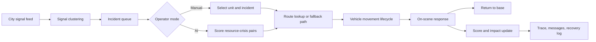

# CIRO Pakistan Dispatch Simulator

CIRO is a real-time emergency dispatch operations simulator for Pakistan cities, adapted for the Challenge 3 requirements and inspired by live-dispatch interaction patterns. It runs client-side with mocked civic signals plus public/open station data: signals arrive over time, incidents activate, manual or AI dispatch sends units, vehicles move along road routes or stable fallback paths, actions simulate before/after impact, and the operator can review agent reasoning, stakeholder messaging, and recovery logs.

Antigravity is treated as a development and orchestration aid used to build the project. It is not a runtime dependency, SDK, data source, or browser requirement inside the app.

## Current Operations Loop



The simulation loop is:

`signals arrive -> clusters form -> incidents appear -> operator or AI dispatches units -> routes draw -> vehicles move -> actions simulate -> outcomes update`.

## Implemented Challenge 3 Coverage

| Requirement | Implementation |
| --- | --- |
| 16 required cities | `CITY_REGISTRY` covers Karachi, Islamabad, Lahore, Rawalpindi, Faisalabad, Multan, Gujranwala, Sialkot, Bahawalpur, Sargodha, Peshawar, Abbottabad, Quetta, Gwadar, Hyderabad, and Sukkur. |
| 8+ signals per city | `getCityData(city)` returns at least 8 social, weather, traffic, field, sensor, or emergency-call signals per city. |
| 6+ resources per city | Each city has sourced deployable resources generated from an OpenStreetMap/Overpass station snapshot. |
| 2 simultaneous crises | Each city has two concurrent crisis scenarios with severity, confidence, affected population, and local locations. |
| Conflict and false-alarm handling | Low-credibility conflicting signals and retraction/correction actions are retained in the scenario data and surfaced in the UI. |
| Manual dispatch | Manual mode lets an operator select a unit and click an incident marker to dispatch along a route. |
| AI dispatch | AI scores available units by severity, confidence, affected population, type match, travel time, and availability before movement starts. |
| Moving units on paths | Routes are drawn on the map; units transition `available -> en_route -> on_scene -> returning -> available`. |
| Time controls | The command bars expose pause/resume and `1x`, `2x`, `5x`, `10x`, `20x`; at `1x`, one real second advances one route second. |
| Agent trace | The HUD shows observation, inference, decision, and execution for incident activation, allocation, and actions. |
| Before/after impact | The impact HUD shows action before state, after state, and side effects. |
| Stakeholder messaging | Crisis detail panels show public, emergency services, hospital, utility, transport, and media notifications. |
| Recovery/fallback | Action traces include API failure fallback cases such as traffic, hospital, or cached-route recovery. |

## Architecture

- React, TypeScript, Vite, Zustand, MapLibre GL, and Vitest.
- Runtime state is client-side only. There is no backend and no real sensitive emergency data.
- City scenario access goes through `src/data/cityData.ts`.
- Station-backed resource data is generated into `src/data/stationResources.ts`.
- City metadata is centralized in `src/data/cities.ts`.
- The live shift engine is in `src/simulation/sessionEngine.ts`.
- Vehicle movement and lifecycle rules are in `src/simulation/movementEngine.ts`.
- AI resource scoring is in `src/agents/resourceAllocator.ts`.
- Agent orchestration is in `src/agents/orchestrator.ts`.
- Map rendering, unit markers, and route layers live under `src/components/map`.

## Data Model

The main domain types are defined in `src/types/index.ts`:

- `City` and `CITY_REGISTRY` for city identity, coordinates, population, weather query, and scenario metadata.
- `Signal`, `SignalCluster`, and `Crisis` for signal fusion and incident activation.
- `DispatchSession`, `IncidentRuntime`, and `GameScore` for shift state and scoring.
- `Resource` for vehicles/resources, route coordinates, traffic metadata, assignment history, cooldowns, source provenance, and ETA.
- `ResourceAllocation` for AI dispatch scores and reasoning.
- `Action`, `ImpactSnapshot`, `StakeholderMessage`, and `AgentTraceEvent` for Challenge 3 evidence.

## APIs And Tools

- TomTom Routing is used for traffic-aware routes when `VITE_TOMTOM_API_KEY` is present at build time.
- OSRM public demo routing is used as the no-key fallback for road route geometry and ETA.
- Stable straight-line fallback routes are used only when route providers are unavailable.
- OpenStreetMap/Overpass is used at development time to generate the static station snapshot; the app and APK do not query Overpass at runtime.
- Weather, social, traffic, field reports, and emergency calls are mocked for demo safety.
- No live emergency systems, private data, user location, or civic credentials are used.

## Cost, Latency, And Safety Assumptions

- Mocked local signals have no runtime API cost.
- TomTom traffic routing is optional and depends on the developer-provided API key and network availability.
- OSRM routing is best-effort and can fail safely to local fallback paths.
- Simulated action costs and latency are stored in the action model and surfaced in the UI.
- All public alerts and stakeholder messages are simulated; nothing is sent externally.
- The app is intended for challenge demo and prototype evaluation, not operational emergency use.

## Scalability Notes

- Adding a city requires a registry entry plus generated or authored signals, station-backed resources, crises, actions, and messages.
- The session engine is deterministic enough for tests but still interactive through time controls and dispatch choices.
- Map rendering is incremental: vehicle marker DOM nodes are reused while positions update on each tick.
- The current bundle is large because MapLibre and Recharts ship in the main app chunk; code splitting is a future optimization.

## Known Limitations

- Traffic-aware routing depends on a TomTom API key. Without it, the app visibly falls back to OSRM and marks routes as non-traffic-aware.
- AI dispatch is a transparent scoring heuristic, not a live LLM agent.
- Capacitor Android is a first-class target, but local Android SDK/emulator availability still determines whether native smoke checks can be run on a given machine.
- Challenge data is realistic mock data, not verified live civic data.

## Development

```bash
npm install
npm run dev
npm test
npm run lint
npm run build
npm run stations:generate
```

Optional traffic routing:

```bash
VITE_TOMTOM_API_KEY=your_key_here npm run build
```

Capacitor Android target:

```bash
npm run build
npx cap add android    # only needed once if the android platform folder is absent
npx cap sync android
```

Native debug APK build prerequisites: JDK 11 or newer plus the Android SDK/command-line tools. On Windows, run:

```bash
cd android
.\gradlew.bat assembleDebug
```

The APK uses the same built web app in Android WebView. Core dispatch, station resources, OSRM fallback routing, time controls, and route badges must work without a localhost dependency. TomTom traffic works in the APK only when the key is present during the production build.

## Demo Script

1. Start the app and choose a city from the top city selector.
2. Press `Simulate` to start the live shift clock.
3. Use `1x`, `2x`, `5x`, `10x`, or `20x`; at `1x`, vehicles should move in real route time.
4. Switch to `Manual`, select a unit from the unit roster, and click an incident marker.
5. Confirm the route draws and the vehicle moves to the incident.
6. Confirm route badges show `Traffic-aware` when TomTom is configured or `OSRM fallback` without a key.
7. Press `AI Dispatch` and watch multiple units receive scored assignments.
8. Open the agent trace HUD and verify observation, inference, decision, and execution entries.
9. Review the before/after impact HUD and a crisis detail panel's actions/messages tabs.
10. Wait for units to arrive; the score HUD should update handled incidents and response time.
11. Confirm units move through on-scene and returning states before becoming available again.
