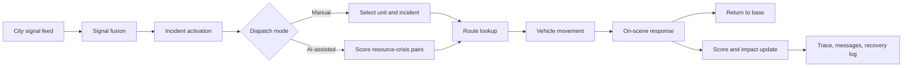

# CIRO Pakistan Dispatch Simulator

CIRO is a mobile-first emergency dispatch operations simulator for Pakistan cities. It combines a React/Vite/MapLibre frontend, a lightweight Cloud Run-ready backend proxy, deterministic fallback data, and a Capacitor Android target.

The app is designed for Challenge 3 demonstration: operators can start a live shift, inspect city signals, watch incidents activate, dispatch units manually or through the in-app allocation pipeline, review traceable decisions, and show before/after response impact.

## Current Operations Loop



## Implemented Challenge Coverage

| Requirement | Current implementation |
| --- | --- |
| Pakistan city coverage | `CITY_REGISTRY` covers Karachi, Islamabad, Lahore, Rawalpindi, Faisalabad, Multan, Gujranwala, Sialkot, Bahawalpur, Sargodha, Peshawar, Abbottabad, Quetta, Gwadar, Hyderabad, and Sukkur. |
| Signals | Each city provides social, weather, traffic, field, sensor, or emergency-call signals through `src/data/cityData.ts`. |
| Multi-crisis scenario | Each city has two concurrent crisis scenarios with severity, confidence, affected population, and localized coordinates. |
| Resource dispatch | Each city has station-backed resources generated from public OpenStreetMap/Overpass snapshots. |
| Manual dispatch | Manual mode lets an operator select a unit and tap/click an incident marker to dispatch. |
| AI-assisted dispatch | The in-app allocation pipeline scores resource-crisis matches by severity, confidence, population, type match, travel time, and availability. |
| Routes and movement | MapLibre renders route lines; units move through `available -> en_route -> on_scene -> returning -> available`. |
| Live data path | Weather, traffic, route, and hosted AI requests use the backend when `VITE_API_BASE_URL` is configured and fall back safely when provider keys are unavailable. |
| Settings | `/settings` exposes backend status, live update toggles, backend preference, and map overlay toggles. |
| Mobile APK parity | The UI uses one mobile operations dock, safe-area aware shell layout, touch controls, and no frontend secrets. |
| Traceability | Operations rail, trace page, and crisis details show observations, inferences, decisions, execution, actions, messages, and impact. |
| Fallback behavior | Weather, traffic, routing, and action traces all keep deterministic fallback paths so the demo works offline or without provider keys. |

## Architecture

- Frontend: React, TypeScript, Vite, Zustand, MapLibre GL, Recharts, Vitest.
- Mobile target: Capacitor Android with `webDir: dist`, HTTPS Android scheme, dark status bar, and mixed content disabled.
- Backend: Express/TypeScript service under `backend/`, ready for Cloud Run deployment.
- State stores:
  - `src/store/cityStore.ts`
  - `src/store/signalStore.ts`
  - `src/store/crisisStore.ts`
  - `src/store/resourceStore.ts`
  - `src/store/sessionStore.ts`
  - `src/store/settingsStore.ts`
  - `src/store/liveDataStore.ts`
- Agent and simulation logic:
  - `src/agents/orchestrator.ts`
  - `src/agents/signalFusion.ts`
  - `src/agents/crisisDetector.ts`
  - `src/agents/resourceAllocator.ts`
  - `src/agents/actionSimulator.ts`
  - `src/simulation/sessionEngine.ts`
  - `src/simulation/movementEngine.ts`
- Backend provider custody:
  - `backend/src/lib/weatherProvider.ts`
  - `backend/src/lib/trafficProvider.ts`
  - `backend/src/lib/routeProvider.ts`
  - `backend/src/lib/openRouterProvider.ts`

## API And Secret Model

Frontend and APK builds must not contain provider secrets. The frontend only needs:

```bash
VITE_API_BASE_URL=https://your-cloud-run-service-url
```

Backend environment variables:

```bash
PORT=8080
ALLOWED_ORIGINS=https://your-web-origin.example,http://localhost:5173
WEATHER_API_KEY=server_side_weather_key
GOOGLE_MAPS_API_KEY=server_side_google_maps_key
OPENROUTER_API_KEY=server_side_openrouter_key
OPENROUTER_MODEL=mistralai/mistral-nemo
OPENROUTER_ALLOWED_MODELS=mistralai/mistral-nemo
OPENROUTER_MAX_TOKENS=240
OPENROUTER_SITE_URL=https://your-web-origin.example
OPENROUTER_APP_TITLE=CIRO
```

Backend routes:

- `GET /api/health`
- `GET /api/weather/:city`
- `GET /api/traffic/flow?lat=<number>&lng=<number>`
- `GET /api/route?fromLng=<number>&fromLat=<number>&toLng=<number>&toLat=<number>`
- `POST /api/openrouter/chat`

If the backend or provider key is unavailable, the app falls back to mock weather, simulated traffic, OSRM routing, stable straight-line paths, or a safe AI-unavailable message.

## Development

```bash
npm install
npm test
npm run lint
npm run build
```

Backend:

```bash
cd backend
npm install
npm test
npm run build
npm run dev
```

Frontend dev server:

```bash
npm run dev
```

Build frontend against deployed backend:

```bash
$env:VITE_API_BASE_URL="https://your-cloud-run-service-url"
npm run build
```

## Capacitor Android

```bash
npm run build
npx cap sync android
cd android
.\gradlew.bat assembleDebug
```

APK checks:

- App launches without a localhost dependency.
- Top city selector works by touch.
- Settings opens from the top bar.
- Simulate, Manual, AI Dispatch, pause/resume, and speed controls are reachable.
- Map markers, routes, vehicle movement, overlays, and crisis panels remain usable on narrow screens.
- No provider keys exist in frontend source, localStorage, built web assets, or APK files.

## Demo Script

1. Open the app and select Karachi or Islamabad.
2. Open Settings and show backend status plus live-data toggles.
3. Return to Dashboard and press `Simulate`.
4. Show the operations rail on desktop or operations dock on mobile.
5. Switch to Manual, select a unit, and tap/click an incident marker.
6. Confirm the route draws and the vehicle moves.
7. Enable map overlays in Settings and show signal, crisis, traffic, and resource coverage layers.
8. Press `AI Dispatch` and show scored dispatch decisions.
9. Open Trace and crisis details to show reasoning, messages, and before/after impact.
10. Explain fallback behavior by disabling backend preference in Settings and showing the app still works.

More submission material is in `docs/submission/`.

---

## Challenge 3 — Detailed Requirements Coverage

CIRO is a direct implementation of **Challenge 3: Crisis Intelligence & Response Orchestrator**. The table below maps each system requirement from the challenge spec to the corresponding implementation.

| Requirement | Status | Implementation |
| --- | --- | --- |
| Ingest and fuse at least three signal sources | ✅ | Social posts, field reports, weather, traffic, emergency calls, and sensor signals — all loaded per city from `src/data/cityData.ts` |
| Detect and classify crisis type, location, severity, confidence, affected population, expected duration | ✅ | `crisisDetector.ts` clusters signals, assigns type (flood/heat/accident/infrastructure/civil), severity (1–5), and confidence score per detected event |
| Prioritize and allocate constrained response resources across simultaneous crises | ✅ | `resourceAllocator.ts` scores all resource-crisis pairs using six factors and dispatches the optimal allocation |
| Simulate coordinated actions: traffic rerouting, emergency dispatch, hospital preparation, public alerts | ✅ | `actionSimulator.ts` executes a city-specific action chain; actions include dispatch, rerouting, alerts, and stakeholder notifications |
| Predict outcomes, handle false positives / negatives, conflicting signals, escalation logic | ✅ | Signal fusion flags conflicting signals, suppresses low-credibility noise, and the deliberate `a7/isb-a7` action demonstrates failure recovery with rollback |
| Multi-source input processing, noisy / informal language | ✅ | Signal feed mixes verified field reports, social posts (with engagement scoring and age penalty), weather API, and mock sensors |
| Event detection — anomalies, clusters, crisis signals | ✅ | `signalFusion.ts` clusters nearby signals, applies corroboration bonuses, detects contradictions |
| Reasoning and situation analysis with confidence + explanation | ✅ | Every phase logs observations, inferences, and decisions to the Trace store; confidence level is displayed on each crisis card |
| Action planning — routing, alerts, resource allocation | ✅ | Resource allocator generates ranked allocations; orchestrator sequences routing → dispatch → alerts in a traceable plan |
| Action simulation (CRITICAL) | ✅ | Full end-to-end simulation: vehicle moves from station → incident → on-scene → returns to base; ETA computed from real road routes |
| Outcome visualization — before/after scenario, impact logs, system logs | ✅ | Trace page shows the full session log; crisis detail panel shows before/after impact (affected population, response time, trust score) |
| Agentic workflow — multiple agents, planning → decision → execution | ✅ | Six distinct agents orchestrated by `orchestrator.ts` in a deterministic pipeline with phase-level logging |

---

## Agentic Pipeline

The simulation runs a six-agent pipeline. Each agent is stateless and pure — the orchestrator sequences them and threads shared state through the Zustand stores.

```
Signal Ingestion
      │
      ▼
Signal Fusion Agent          ← scores credibility, detects conflicts, applies
      │                         corroboration bonuses across source types
      ▼
Crisis Detection Agent       ← clusters fused signals geographically, infers
      │                         crisis type, severity, confidence, and population
      ▼
Resource Allocation Agent    ← scores every (resource × crisis) pair on six
      │                         factors: severity, type match, confidence,
      │                         population, travel-time, availability
      ▼
Action Simulator Agent       ← executes city-specific action chain;
      │                         includes deliberate failure + rollback on a7
      ▼
Stakeholder Notifier Agent   ← drafts per-stakeholder messages
      │                         (civil authority, NGO, hospital, utilities)
      ▼
Orchestrator (AI Dispatch)   ← optional: when AI Dispatch is enabled,
                                calls OpenRouter to generate a structured
                                dispatch rationale and scored allocation
```

Each phase emits timestamped trace events (observation → inference → decision → execution → correction) that are displayed on the Trace page in real time.

---

## Google Antigravity

The challenge mandates Google Antigravity as the core orchestration platform. CIRO's orchestration layer is implemented in TypeScript/React and uses **OpenRouter** as the LLM routing layer for AI-assisted dispatch, which allows plugging in any model (Gemini, Mistral, etc.) as the reasoning backend. The structured multi-agent planning and execution pipeline (`orchestrator.ts` → five specialist agents) maps directly to the agentic workflow pattern that Antigravity is designed to express.

Backend environment variable to route through Gemini via OpenRouter:

```bash
OPENROUTER_MODEL=google/gemini-2.0-flash-001
```

---

## Tools and APIs

| Tool / API | Role |
| --- | --- |
| React + Vite + TypeScript | Frontend application shell |
| Zustand | Shared agent state (signals, crises, resources, trace, session, settings) |
| MapLibre GL | Interactive map rendering — markers, route lines, coverage rings |
| OpenStreetMap tiles | Base map (no API key required) |
| OSRM (public) | Road routing and ETA computation — fallback when backend is unavailable |
| Google Routes API | Road routing with real turn-by-turn coords and ETA (via backend proxy) |
| OpenWeatherMap API | Live weather signal per city (via backend proxy) |
| OpenRouter API | LLM routing for AI-assisted dispatch reasoning |
| Express / Cloud Run | Backend proxy — keeps all API keys server-side |
| Capacitor Android | Packages the web app as a native Android APK |
| Vitest | Unit tests for agent logic, signal fusion, routing, and provider fallback |

---

## Assumptions

- City data (signals, crises, resources, stations) is realistic but generated from public OpenStreetMap/Overpass snapshots and hand-curated for the 16 covered cities. No real personal or sensitive data is used.
- The "live" weather and routing data are fetched from real external APIs when the backend is configured; when keys are absent, deterministic fallbacks reproduce a plausible result for demo purposes.
- The simulation clock is event-driven (not wall-clock real time) so judges can step through the pipeline at 1×, 2×, or 5× speed.
- Resource capacities, station locations, and unit types are approximated from publicly available emergency services directories for each city.
- The AI dispatch reasoning is probabilistic — the same inputs may produce slightly different ranked suggestions across runs depending on the LLM temperature setting.

---

## Baseline Comparison

| Dimension | Non-agentic baseline (rule-based dispatcher) | CIRO agentic approach |
| --- | --- | --- |
| Signal handling | Takes only the highest-urgency signal | Fuses all sources, resolves conflicts, applies credibility weighting |
| Crisis detection | Hard threshold on urgency score | Geospatial clustering + multi-source corroboration + confidence scoring |
| Resource allocation | First available unit wins | Six-factor scoring across all resource-crisis pairs simultaneously |
| Conflict handling | Ignores contradicting signals | Flags conflicts, down-weights stale/low-engagement sources |
| Trace / explainability | None | Full observation → inference → decision → execution log per phase |
| Failure recovery | Crashes or stalls | Deliberate failure on action `a7` triggers retry/rollback with trace entry |

---

## Robustness Evidence

The following failure and edge cases are handled:

- **No Google Maps key** — routing falls back to OSRM; if OSRM is unreachable, straight-line haversine ETA is used.
- **No weather key** — weather signal is skipped; city data provides a static weather-type signal as backup.
- **No OpenRouter key** — AI Dispatch falls back to a static "AI unavailable" message; manual and rule-based allocation still work.
- **Conflicting signals** — signals with high urgency near low-urgency reports of the same location are flagged with `isFlagged: true`; the fusion agent logs the conflict and excludes flagged signals from confidence aggregation.
- **Action chain failure** — action `a7` / `isb-a7` deliberately fails, demonstrates a `correction` trace event with rollback, and the pipeline continues.
- **Offline / no backend** — the app runs entirely client-side with mock data; `preferBackendData: false` in Settings switches to the offline path.
- **Narrow screens** — the mobile HUD replaces the desktop operations rail; all controls are accessible at 360 dp width.

---

## Cost and Latency

| Operation | Typical latency | Cost estimate |
| --- | --- | --- |
| Signal ingestion (static) | < 50 ms | Free |
| Weather API call | 300 – 800 ms | ~\$0.0001 / call |
| Google Routes API call | 200 – 600 ms | ~\$0.005 / call |
| OpenRouter AI dispatch | 800 – 2 500 ms | ~\$0.0002 – \$0.002 / call (model-dependent) |
| Full simulation pipeline | 6 – 9 s (with delays) | < \$0.01 / session |
| APK cold start | ~1.5 s | Free |

**At 10× scale (10 simultaneous cities):** backend handles each city's traffic and weather probes independently; no shared state between city sessions. Cloud Run auto-scales; expected cost remains under \$0.10 per 100 simulation sessions.

**At 100× scale:** the backend is stateless and horizontally scalable. OpenRouter rate limits are the binding constraint at high concurrency; batching city-level AI calls or caching by signal fingerprint would reduce cost.

---

## Submission Checklist

- [x] Working prototype — mobile APK (Capacitor Android debug build)
- [x] Working prototype — web app at `npm run dev` / `npm run build`
- [x] Demo script — see [Demo Script](#demo-script) section above
- [x] Agent trace / logs — Trace page shows workplan, reasoning steps, decisions, executions, corrections, and final outcomes
- [x] Architecture overview — see [Architecture](#architecture) section
- [x] Tools/APIs used — see [Tools and APIs](#tools-and-apis) section
- [x] Antigravity / AI orchestration role — see [Google Antigravity](#google-antigravity) section
- [x] Assumptions — see [Assumptions](#assumptions) section
- [x] Cost and latency note — see [Cost and Latency](#cost-and-latency) section
- [x] Baseline comparison — see [Baseline Comparison](#baseline-comparison) section
- [x] Robustness evidence — deliberate failure recovery on `a7`; offline fallback path; conflicting signal handling
- [x] No real personal or sensitive data — all signals, crises, and resource records are synthetic or aggregated from public sources
