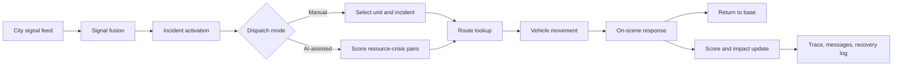

# CIRO Pakistan Dispatch Simulator

CIRO is a mobile-first emergency dispatch operations simulator for Pakistan cities. It combines a React/Vite/MapLibre frontend, a lightweight Cloud Run-ready backend proxy, deterministic fallback data, and a Capacitor Android target.

The app is designed for Challenge 3 demonstration: operators can start a live shift, inspect city signals, watch incidents activate, dispatch units manually or through the in-app allocation pipeline, review traceable decisions, and show before/after response impact.

## Current Operations Loop



## Implemented Challenge Coverage

| Requirement | Current implementation |
| --- | --- |
| Pakistan city coverage | `CITY_REGISTRY` covers Karachi, Islamabad, Lahore, Rawalpindi, Faisalabad, Multan, Gujranwala, Sialkot, Bahawalpur, Sargodha, Peshawar, Abbottabad, Quetta, Gwadar, Hyderabad, and Sukkur. |
| Signals | Each city provides social, weather, traffic, field, sensor, or emergency-call signals through `src/data/cityData.ts`. |
| Multi-crisis scenario | Each city has two concurrent crisis scenarios with severity, confidence, affected population, and localized coordinates. |
| Resource dispatch | Each city has station-backed resources generated from public OpenStreetMap/Overpass snapshots. |
| Manual dispatch | Manual mode lets an operator select a unit and tap/click an incident marker to dispatch. |
| AI-assisted dispatch | The in-app allocation pipeline scores resource-crisis matches by severity, confidence, population, type match, travel time, and availability. |
| Routes and movement | MapLibre renders route lines; units move through `available -> en_route -> on_scene -> returning -> available`. |
| Live data path | Weather, traffic, route, and hosted AI requests use the backend when `VITE_API_BASE_URL` is configured and fall back safely when provider keys are unavailable. |
| Settings | `/settings` exposes backend status, live update toggles, backend preference, and map overlay toggles. |
| Mobile APK parity | The UI uses one mobile operations dock, safe-area aware shell layout, touch controls, and no frontend secrets. |
| Traceability | Operations rail, trace page, and crisis details show observations, inferences, decisions, execution, actions, messages, and impact. |
| Fallback behavior | Weather, traffic, routing, and action traces all keep deterministic fallback paths so the demo works offline or without provider keys. |

## Architecture

- Frontend: React, TypeScript, Vite, Zustand, MapLibre GL, Recharts, Vitest.
- Mobile target: Capacitor Android with `webDir: dist`, HTTPS Android scheme, dark status bar, and mixed content disabled.
- Backend: Express/TypeScript service under `backend/`, ready for Cloud Run deployment.
- State stores:
  - `src/store/cityStore.ts`
  - `src/store/signalStore.ts`
  - `src/store/crisisStore.ts`
  - `src/store/resourceStore.ts`
  - `src/store/sessionStore.ts`
  - `src/store/settingsStore.ts`
  - `src/store/liveDataStore.ts`
- Agent and simulation logic:
  - `src/agents/orchestrator.ts`
  - `src/agents/signalFusion.ts`
  - `src/agents/crisisDetector.ts`
  - `src/agents/resourceAllocator.ts`
  - `src/agents/actionSimulator.ts`
  - `src/simulation/sessionEngine.ts`
  - `src/simulation/movementEngine.ts`
- Backend provider custody:
  - `backend/src/lib/weatherProvider.ts`
  - `backend/src/lib/trafficProvider.ts`
  - `backend/src/lib/routeProvider.ts`
  - `backend/src/lib/openRouterProvider.ts`

## API And Secret Model

Frontend and APK builds must not contain provider secrets. The frontend only needs:

```bash
VITE_API_BASE_URL=https://your-cloud-run-service-url
```

Backend environment variables:

```bash
PORT=8080
ALLOWED_ORIGINS=https://your-web-origin.example,http://localhost:5173
WEATHER_API_KEY=server_side_weather_key
TOMTOM_API_KEY=server_side_tomtom_key
OPENROUTER_API_KEY=server_side_openrouter_key
OPENROUTER_MODEL=google/gemma-4-26b-a4b-it:free
OPENROUTER_ALLOWED_MODELS=google/gemma-4-26b-a4b-it:free
OPENROUTER_MAX_TOKENS=240
OPENROUTER_SITE_URL=https://your-web-origin.example
OPENROUTER_APP_TITLE=CIRO
```

Backend routes:

- `GET /api/health`
- `GET /api/weather/:city`
- `GET /api/traffic/flow?lat=<number>&lng=<number>`
- `GET /api/route?fromLng=<number>&fromLat=<number>&toLng=<number>&toLat=<number>`
- `POST /api/openrouter/chat`

If the backend or provider key is unavailable, the app falls back to mock weather, simulated traffic, OSRM routing, stable straight-line paths, or a safe AI-unavailable message.

## Development

```bash
npm install
npm test
npm run lint
npm run build
```

Backend:

```bash
cd backend
npm install
npm test
npm run build
npm run dev
```

Frontend dev server:

```bash
npm run dev
```

Build frontend against deployed backend:

```bash
$env:VITE_API_BASE_URL="https://your-cloud-run-service-url"
npm run build
```

## Capacitor Android

```bash
npm run build
npx cap sync android
cd android
.\gradlew.bat assembleDebug
```

APK checks:

- App launches without a localhost dependency.
- Top city selector works by touch.
- Settings opens from the top bar.
- Simulate, Manual, AI Dispatch, pause/resume, and speed controls are reachable.
- Map markers, routes, vehicle movement, overlays, and crisis panels remain usable on narrow screens.
- No provider keys exist in frontend source, localStorage, built web assets, or APK files.

## Demo Script

1. Open the app and select Karachi or Islamabad.
2. Open Settings and show backend status plus live-data toggles.
3. Return to Dashboard and press `Simulate`.
4. Show the operations rail on desktop or operations dock on mobile.
5. Switch to Manual, select a unit, and tap/click an incident marker.
6. Confirm the route draws and the vehicle moves.
7. Enable map overlays in Settings and show signal, crisis, traffic, and resource coverage layers.
8. Press `AI Dispatch` and show scored dispatch decisions.
9. Open Trace and crisis details to show reasoning, messages, and before/after impact.
10. Explain fallback behavior by disabling backend preference in Settings and showing the app still works.

More submission material is in `docs/submission/`.
