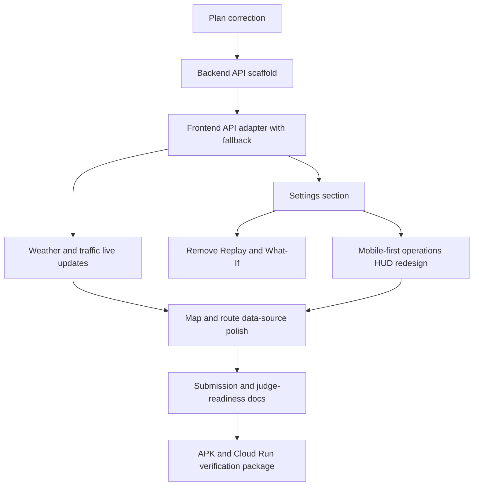

# CIRO Master Implementation Plan

**Updated:** 2026-05-19
**Purpose:** Define the safe branch-by-branch implementation sequence for making CIRO submission-ready without regressing the current working app.

This plan replaces the earlier backend-heavy draft. The current CIRO app already has working in-app agents, dispatch simulation, MapLibre routes, Zustand stores, and Capacitor Android support. The implementation strategy below preserves that working core and adds only the pieces needed for safer secrets custody, better live data, mobile-first UX, and judge-ready submission evidence.

---

## Locked Scope

### Keep

- Keep the current React/Vite/Zustand/MapLibre/Capacitor app architecture.
- Keep the current in-app agent pipeline in `src/agents`.
- Keep current deterministic/fallback behavior so the demo and APK still work when the backend is unavailable.
- Keep the `Compare` page because it supports the baseline comparison requirement.
- Keep atomic branches, atomic commits, pushed remote branches, and pull requests for each feature slice.
- Keep mobile APK parity as a hard requirement for every runtime change.

### Add

- Add a lightweight backend API hosted on Google Cloud Run for server-held API keys and environment variables.
- Proxy weather, traffic, and routing requests through the backend when `VITE_API_BASE_URL` is configured.
- Add weather and traffic live update streaming/polling from the backend while preserving offline/mock fallback.
- Add a dedicated Settings section for data-source mode, backend health, weather/traffic toggles, and map layer toggles.
- Redesign the scattered dashboard HUD into a coherent mobile-first operations surface that still works well on desktop.
- Add submission documentation and checklists for APK, Cloud Run, GitHub, demo video, logs, README coverage, and judge evidence.

### Remove

- Remove `ReplayPage` and `WhatIfPage` from routes and navigation.
- Remove any stale wording that suggests replacing the working frontend orchestration or moving all agents to the backend.
- Do not add frontend API keys, localStorage secrets, bundled APK secrets, or screenshot/log secrets.

---

## Branch, PR, And Merge Rules

1. Start every feature branch from latest `origin/master`.
2. Use neutral branch names only: `feature/...`, `fix/...`, `docs/...`, or `test/...`.
3. Push every branch to `origin`.
4. Open a pull request for every atomic feature slice.
5. Run the relevant targeted tests plus:
   - `npm test`
   - `npm run build`
   - `npm run lint`
6. Merge the PR only when verification passes and GitHub reports no merge conflicts.
7. For dependent work, merge the prerequisite PR first, pull latest `master`, then create the next branch.
8. Do not include tool/vendor names in branch names, commit messages, PR titles, app copy, or project documentation unless the official challenge requirement itself requires naming a platform in submission evidence.

---

## Current Codebase Truth

The app currently includes:

- App routes in `src/App.tsx`.
- Layout shell, desktop sidebar, mobile bottom nav, and top bar in `src/components/layout`.
- Main map-first operations page in `src/pages/Dashboard.tsx`.
- Current dashboard HUD surfaces:
  - `ControlBar`
  - `SessionStats`
  - `AgentTracePanel`
  - `ImpactPanel`
  - `UnitRoster`
  - `IncidentRegistry`
  - `SignalFeed`
  - `CrisisPanel`
  - `MobileOperationsDock`
- In-app agents in `src/agents`:
  - `orchestrator.ts`
  - `signalFusion.ts`
  - `crisisDetector.ts`
  - `resourceAllocator.ts`
  - `actionSimulator.ts`
  - `stakeholderNotifier.ts`
- Stores in `src/store`:
  - `cityStore.ts`
  - `signalStore.ts`
  - `crisisStore.ts`
  - `resourceStore.ts`
  - `sessionStore.ts`
  - `traceStore.ts`
- Routing API client in `src/api/routing.ts`.
- Weather API client in `src/api/weather.ts`.
- Capacitor config in `capacitor.config.ts`.
- Android project in `android/`.

The safest strategy is to add new backend-backed data paths as optional adapters first, then switch UI surfaces to use them only after fallback behavior is proven.

---

## Dependency Map



No runtime branch after this plan should depend on the stale generated HTML plan folder.

---

## Implementation Sequence

### PR 1: Plan Scope Reset

**Branch:** `feature/implementation-plan-scope-reset`
**Commit:** `docs: reset implementation plan scope`
**Scope:** Documentation only.

**Files:**

- Modify `docs/CIRO_MASTER_IMPLEMENTATION_PLAN.md`.

**Acceptance Criteria:**

- The master plan says the in-app agents stay in the app.
- The backend scope is limited to API-key custody and weather/traffic/routing proxy behavior.
- The plan requires mobile-first behavior and web parity.
- The plan requires remote branches and pull requests for atomic slices.
- The plan permits removing `ReplayPage` and `WhatIfPage`.
- The plan does not instruct future implementers to replace working app behavior.

**Verification:**

- `git diff -- docs/CIRO_MASTER_IMPLEMENTATION_PLAN.md`
- No app build required for docs-only change unless unrelated files changed.

---

### PR 2: Backend API Scaffold

**Branch:** `feature/backend-api-proxy-scaffold`
**Commit:** `feat: add backend api proxy scaffold`
**Depends on:** PR 1 merged.

**Goal:** Add a lightweight backend that can run locally and on Cloud Run, without requiring frontend behavior changes in the same PR.

**Files To Create:**

- `backend/package.json`
- `backend/package-lock.json`
- `backend/tsconfig.json`
- `backend/.env.example`
- `backend/src/index.ts`
- `backend/src/config/env.ts`
- `backend/src/routes/health.ts`
- `backend/src/routes/weather.ts`
- `backend/src/routes/traffic.ts`
- `backend/src/routes/route.ts`
- `backend/src/lib/http.ts`
- `backend/src/lib/weatherProvider.ts`
- `backend/src/lib/trafficProvider.ts`
- `backend/src/lib/routeProvider.ts`
- `backend/src/types.ts`

**Backend Contract:**

- `GET /api/health`
  - Returns backend status, timestamp, and feature flags.
- `GET /api/weather/:city`
  - Returns a weather signal-compatible payload.
  - Uses backend `WEATHER_API_KEY` if set.
  - Returns deterministic mock weather if key/provider fails.
- `GET /api/traffic/flow?lat=<number>&lng=<number>`
  - Returns congestion level, current speed, free-flow speed, provider, and fallback reason.
  - Uses backend `GOOGLE_MAPS_API_KEY` or `GOOGLE_ROUTES_API_KEY` if set.
  - Returns simulated traffic if key/provider fails.
- `GET /api/route?fromLng=<number>&fromLat=<number>&toLng=<number>&toLat=<number>`
  - Returns the existing frontend `RouteResult` shape.
  - Uses backend Google Routes routing if key exists.
  - Falls back to OSRM.
  - If OSRM fails, frontend must still be able to fall back to straight-line local routing.

**Environment Variables:**

- `PORT`
- `ALLOWED_ORIGINS`
- `WEATHER_API_KEY`
- `GOOGLE_MAPS_API_KEY`

**No Runtime App Changes In This PR:**

- Do not modify `src/api/weather.ts`.
- Do not modify `src/api/routing.ts`.
- Do not modify `src/agents/orchestrator.ts`.
- Do not modify Capacitor files.

**Verification:**

- `cd backend; npm install`
- `cd backend; npm run build`
- `cd backend; npm test` if tests are added.
- `npm test`
- `npm run build`
- `npm run lint`

---

### PR 3: Frontend API Adapter With Fallback

**Branch:** `feature/frontend-api-adapter-fallback`
**Commit:** `feat: add frontend api adapter with offline fallback`
**Depends on:** PR 2 merged.

**Goal:** Let the frontend use the backend when configured, while preserving all current local fallback behavior.

**Files To Create:**

- `src/api/client.ts`
- `src/api/backendHealth.ts`
- `src/api/traffic.ts`

**Files To Modify:**

- `src/api/weather.ts`
- `src/api/routing.ts`
- Tests for routing and weather behavior.

**Contract:**

- `VITE_API_BASE_URL` is optional.
- If `VITE_API_BASE_URL` is absent, existing behavior continues.
- If backend request fails, the app uses current mock/OSRM/straight-line fallback.
- No frontend code reads provider API keys such as `VITE_GOOGLE_MAPS_API_KEY` or `VITE_WEATHER_API_KEY` after this migration, unless retained only for backward compatibility with a deprecation note and no APK production usage.

**APK Rules:**

- Production APK uses an HTTPS `VITE_API_BASE_URL`.
- No HTTP-only backend URL in APK.
- No crash when the phone is offline.

**Verification:**

- Unit tests prove backend success path.
- Unit tests prove backend failure fallback path.
- Unit tests prove default `fetch` receiver binding is preserved.
- `npm test`
- `npm run build`
- `npm run lint`

---

### PR 4: Weather And Traffic Live Updates

**Branch:** `feature/weather-traffic-live-updates`
**Commit:** `feat: add weather and traffic live update adapters`
**Depends on:** PR 3 merged.

**Goal:** Add live data refresh behavior for weather and traffic without making the demo dependent on live providers.

**Implementation Rules:**

- Prefer safe polling first because it is easier to verify across browser and Android WebView.
- Poll weather less frequently than traffic.
- Traffic refresh should be scoped to active crisis/resource route areas, not all map tiles.
- Every update must record provider and fallback reason where applicable.

**Files To Modify/Create:**

- `src/api/traffic.ts`
- `src/store/sessionStore.ts` or a focused live data store if needed.
- `src/pages/Dashboard.tsx`
- Tests for refresh/fallback behavior.

**Acceptance Criteria:**

- Weather refresh appears as a signal or status update.
- Traffic refresh updates route metadata or map traffic state.
- Turning the backend off does not break simulation, dispatch, or route drawing.
- Mobile and desktop show the same data-source state.

**Verification:**

- `npm test`
- `npm run build`
- `npm run lint`
- Manual narrow viewport check at 375px width.

---

### PR 5: Settings Section

**Branch:** `feature/settings-data-and-map-controls`
**Commit:** `feat: add settings for backend status and map controls`
**Depends on:** PR 3 merged.

**Goal:** Add a dedicated Settings section for future app settings and current data/map controls.

**Files To Create:**

- `src/store/settingsStore.ts`
- `src/pages/SettingsPage.tsx`
- `src/components/settings/SettingsRow.tsx`

**Files To Modify:**

- `src/App.tsx`
- `src/components/layout/Sidebar.tsx`
- `src/components/layout/TopBar.tsx`
- `src/components/layout/BottomNav.tsx` only if needed for mobile access.

**Settings Keys:**

- `showTrafficLayer`
- `showSignalHeatmap`
- `showCrisisRadius`
- `showResourceCoverage`
- `enableWeatherUpdates`
- `enableTrafficUpdates`
- `preferBackendData`

**Mobile Rule:**

- Settings must be reachable by touch on APK without adding a sixth cramped bottom-nav tab.
- Use a compact top-bar settings button or a mobile menu.

**Verification:**

- Store tests for toggle defaults and persistence if persistence is used.
- UI test if existing test stack supports it.
- `npm test`
- `npm run build`
- `npm run lint`

---

### PR 6: Remove Replay And What-If

**Branch:** `feature/remove-replay-whatif-pages`
**Commit:** `feat: remove replay and what-if pages`
**Depends on:** PR 5 merged.

**Goal:** Remove nonessential pages cleanly while preserving challenge-critical pages.

**Files To Modify:**

- `src/App.tsx`
- `src/components/layout/Sidebar.tsx`
- Any tests or docs that refer to `/replay` or `/whatif`.

**Files To Delete:**

- `src/pages/ReplayPage.tsx`
- `src/pages/WhatIfPage.tsx`

**Keep:**

- `/`
- `/signals`
- `/crises`
- `/resources`
- `/trace`
- `/compare`
- `/settings`

**Verification:**

- `npm test`
- `npm run build`
- `npm run lint`
- Confirm mobile navigation still exposes required flows.

---

### PR 7: Mobile-First Operations HUD Redesign

**Branch:** `feature/mobile-first-operations-hud`
**Commit:** `feat: consolidate operations hud for mobile and web`
**Depends on:** PR 5 merged. PR 6 can be before or after this, but PR 5 must be merged first.

**Goal:** Replace the scattered dashboard HUD experience with a coherent operations interface.

**Current Problem:**

The dashboard currently renders several competing surfaces at once: control bar, stats, trace, impact, unit roster, incident registry, signal feed, crisis detail, and mobile dock. This is powerful but visually noisy and risky on smaller APK screens.

**Design Direction:**

- Mobile: one bottom operations sheet with tabs for command, units, incidents, trace, and impact.
- Desktop: one left or right operations rail plus the existing map as the primary canvas.
- Keep map visible and interactive at all times.
- Avoid overlapping modals except focused crisis detail.
- Use 44px minimum touch targets.
- Use safe-area padding for Android gesture/navigation bars.

**Files Likely To Modify/Create:**

- `src/pages/Dashboard.tsx`
- `src/components/hud/MobileOperationsDock.tsx`
- `src/components/hud/ControlBar.tsx`
- `src/components/hud/SessionStats.tsx`
- `src/components/hud/AgentTracePanel.tsx`
- `src/components/hud/ImpactPanel.tsx`
- `src/components/hud/UnitRoster.tsx`
- `src/components/hud/IncidentRegistry.tsx`
- `src/index.css`
- Focused component tests where existing patterns allow.

**Acceptance Criteria:**

- On 375px width, no critical controls overlap.
- Simulate, Manual, AI Dispatch, pause/resume, and speed controls are reachable by touch.
- Unit selection and crisis marker dispatch still work.
- Trace and impact remain available on mobile.
- Desktop remains dense and useful without looking like stacked popups.
- Map canvas remains visible and interactive.

**Verification:**

- `npm test`
- `npm run build`
- `npm run lint`
- Manual mobile viewport check: 375x667 and 390x844.
- Manual desktop viewport check: 1366x768.

---

### PR 8: Map And Route Data Polish

**Branch:** `feature/map-route-data-polish`
**Commit:** `feat: improve map layers and route data indicators`
**Depends on:** PR 4 and PR 5 merged.

**Goal:** Make weather/traffic/routing status obvious to judges without cluttering the map.

**Features:**

- Traffic overlay toggle.
- Crisis affected-radius overlay toggle.
- Signal heatmap toggle.
- Resource coverage overlay toggle.
- Route provider badges: backend Google Routes, OSRM fallback, straight-line fallback.
- Route refresh timestamp/status in unit detail.

**Files Likely To Modify/Create:**

- `src/components/map/CiroMap.tsx`
- `src/components/map/RouteLayer.ts`
- `src/components/map/TrafficLayer.ts`
- `src/components/hud/UnitRoster.tsx`
- `src/components/hud/MobileOperationsDock.tsx`
- `src/store/settingsStore.ts`
- `src/api/traffic.ts`

**Verification:**

- Unit/store tests for route metadata and settings toggles.
- Map layer smoke check in browser.
- `npm test`
- `npm run build`
- `npm run lint`

---

### PR 9: Submission And Judge Readiness Docs

**Branch:** `docs/submission-judge-readiness`
**Commit:** `docs: add submission and judge readiness package`
**Depends on:** PRs 2-8 merged.

**Goal:** Provide a clean, judge-facing submission package.

**Files To Create/Modify:**

- `README.md`
- `docs/submission/REQUIREMENTS_COMPLIANCE.md`
- `docs/submission/APK_CHECKLIST.md`
- `docs/submission/CLOUD_RUN_SETUP.md`
- `docs/submission/DEMO_SCRIPT.md`
- `docs/submission/VIDEO_SHOTLIST.md`
- `docs/submission/EVIDENCE_CHECKLIST.md`

**README Must Cover:**

- Architecture.
- Data schemas.
- Tools/APIs.
- Setup steps.
- Mobile APK build steps.
- Privacy/safety note.
- Cost/latency notes.
- Scalability discussion.
- Baseline comparison.
- Assumptions and limitations.

**Verification:**

- Docs links resolve.
- Commands listed in README match `package.json`.
- No stale generated plan folder is presented as official evidence.
- `npm test`
- `npm run build`
- `npm run lint`

---

### PR 10: APK And Cloud Run Verification Package

**Branch:** `docs/apk-cloud-run-verification`
**Commit:** `docs: add apk and cloud run verification results`
**Depends on:** Runtime work complete and deploy/APK build available.

**Goal:** Record the final proof needed for submission.

**Files To Create/Modify:**

- `docs/submission/VERIFICATION_RESULTS.md`
- `docs/submission/APK_CHECKLIST.md`
- `docs/submission/CLOUD_RUN_SETUP.md`

**Evidence To Record:**

- APK build command used.
- APK filename/path.
- Android device or emulator version.
- Smoke test results.
- Cloud Run URL.
- Backend health result.
- Weather/traffic/routing backend verification.
- Web build result.
- Known risks.

---

## Required Verification Baseline

Every runtime PR must run:

```powershell
npm test
npm run build
npm run lint
```

Backend PRs must also run:

```powershell
cd backend
npm install
npm run build
```

APK-affecting PRs must additionally document:

```powershell
npm run build
npx cap sync android
cd android
.\gradlew.bat assembleDebug
```

If Android SDK or Gradle is unavailable locally, the PR must state that clearly and include the closest completed verification.

---

## Non-Negotiable Quality Bar

- No frontend API keys.
- No secrets in localStorage.
- No secrets in committed `.env`.
- No app change that works only on web and fails on Android WebView.
- No route, map, or dispatch change without fallback behavior.
- No large unrelated refactors inside feature PRs.
- No branch or PR that combines unrelated requirements.
- No merge before clean verification and no-conflict PR state.
